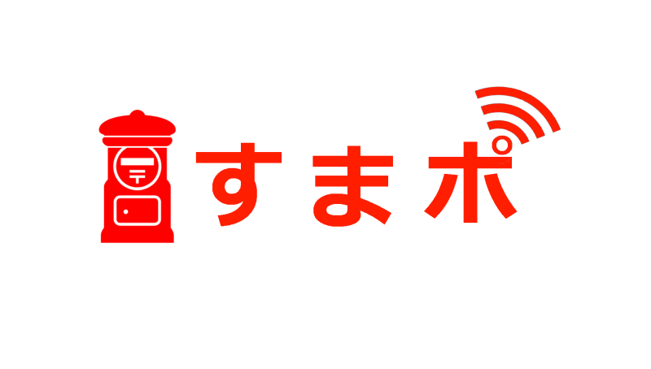
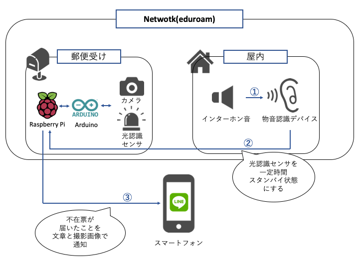

# すまポ

## 製品概要

### Post×Tech

### 背景（製品開発のきっかけ、課題等）

#### 背景
ECの発達とともに、直近5年では取扱個数が約6.1億個増加しています。（国土交通省HPより）それに伴い配達物の再配達が増加しており、人件費や輸送費などのコスト増加や、CO2排出量の増加が問題となっています。
また、受け手側も、郵便物の不在票に気づきにくいという不都合もあり、我々は再三に渡る再配達および配達元への返送を防ぐために本プロダクトの開発に至りました。

#### 課題を解決する対象
①配達業者②日中に外出している方々(主に一人暮らしの社会人・学生)

#### 課題・現状
配達業者：不在通知先への再三の配達, 配達元への返送 「何度も再配達したくない」
日中に外出している方々：配達物をなかなか受け取れない,受け取りを忘れ配達物が配達元へ返送されてしまう「スムーズに荷物を受け取りたい」

### 製品説明（具体的な製品の説明）
ポストに宅配物の不在票が届いたことがユーザーのスマートフォンに通知されるIoTデバイスを開発しました。今まで再三にわたって行われていた再配達を不在票の通知をリアルタイムにすることで、配達業者の人件費・輸送費などのコスト削減、ユーザーの配達物のスムーズな受け取りを実現します。

[]
### 特長

#### 1. 不在票が届いたことが文章と画像でリアルタイムに通知
外出時に配達不在票が届くとLINE経由ですぐに通知が行くため、外出中に再配達の手続きを行うことができ、配達サイクルが効率化され、配達業者のコスト削減・CO2排出量減少・ユーザーの不便解消につながります。

#### 2. 全ての配達業者の不在票を一括管理
各配達業者が不在票の通知サービスを行なっていますが、各社に登録する必要があります。本プロダクトでは各社サービスに登録することなく、一つのサービスのみで全ての配達業者に対応でき、ユーザーへの負担が削減されます。

#### 3. チラシなどの他の投函物と不在票を識別
物音認識でインターホン音を検知し、光センサでポストの開閉を検知することで、ポストの開閉のみ行われるチラシなどの他の投函物と、インターホンを鳴らしてから投函される不在票を区別することができます。その構造を用いて不在票のみを識別可能な仕組みを作りました。

### 解決出来ること
不在票の存在に気付かず再配達が何度も行われてしまうことや配達元へ返送されてしまうことを解決し、配達業界のコスト削減、配達時に排出されるCO2の削減を実現します。
また、ユーザーの再配達依頼をスムーズにすることで、再配達の配達物受け取りを確実にします。
本プロダクトを通して、ユーザーと配達事業者とのwin-winの関係を築きます。

### 今後の展望
* スマートスピーカーの物音認識が可能になることによる汎用性の向上。
* OCRを用いて不在票のデータを読み取り、自動で再配達の手配を行えるようなシステムの構築。

## 開発内容・開発技術
### 活用した技術
#### API・データ
* 物音認識API(NEC)
* LINE Notify

#### フレームワーク・ライブラリ・モジュール
* Socket通信(TCP/IP )
* Serial通信
* Arduino IDE

#### デバイス
* Raspberry Pi
* Arduino
* CdSセル(光センサ)
* Raspberry Pi camera v2

### 研究内容・事前開発プロダクト（任意）
### 独自開発技術（Hack Dayで開発したもの）
#### 2日間に開発した独自の機能・技術
* 独自で開発したものの内容をこちらに記載してください
* 特に力を入れた部分をファイルリンク、またはcommit_idを記載してください（任意）
* 物音認識エンジンでインターホンの音を認識し、その後ポスト側のRaspberryPiのセンサーの立ち上げ
* 不在票がポストに投函
* サーバ(ポスト側)-クライアント(インターホン音を認識する側)通信およびArduino(光センサ)-Raspberry Pi 間の通信を構築する点

